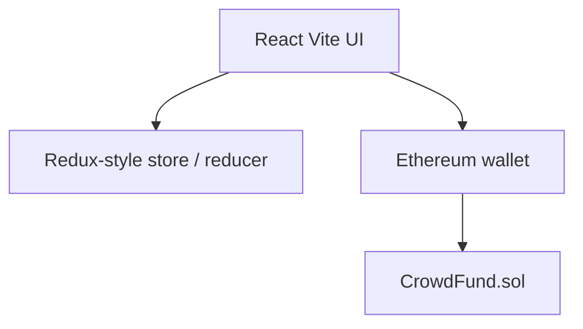

# FundRaiser (Fundereum)

Crowdfunding DApp concept where NGOs and campaigns raise funds on-chain with crypto. Solidity crowdfunding contract plus a React (Vite) front end for browsing projects, contributing, and account flows.

## Idea

Campaigns publish funding goals. Supporters send crypto. The contract records pledges and project state. The UI wraps that flow with Tailwind styling and a simple store/reducer pattern.

## Architecture



Key files:

- `CrowdFund.sol` - crowdfunding contract
- `CrowdFund.json` / `.dbg.json` - compile artifacts
- `main.jsx`, `Body.jsx`, `Project.jsx`, `Account.jsx`, `SignUp.jsx` - UI
- `hardhat.config.js` - Hardhat tooling
- `vite.config.js` - frontend build

## Stack

- Solidity + Hardhat
- React + Vite + Tailwind
- Wallet interaction for on-chain calls

## Run (frontend)

```bash
npm install
# or: yarn
npm run dev
```

## Contracts

```bash
# compile / build via Hardhat scripts in package.json
npm run build
```

Deploy targets depend on your network config in `hardhat.config.js` and wallet keys (never commit private keys).

## Status

Prototype / academic-style DApp. Review contracts carefully before any mainnet use.
